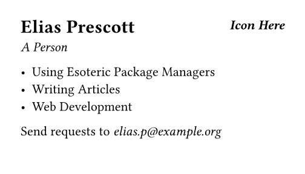
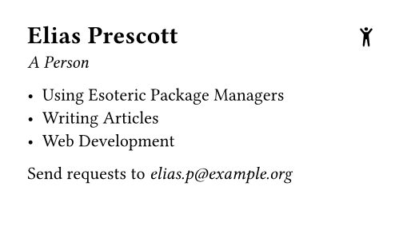

:blogpost: true
:date: 2026-01-07
:author: Elias Prescott

Automate Your Documents with Typst and Nix
==========================================

With just three tools, `Typst`_, `Nix`_, and `Git`_, you can define exactly how you want a document laid out, exactly how you want it compiled, and exactly how it changes over time.
Here is the full list of advantages:

.. _Typst: https://typst.app
.. _Nix: https://nixos.org
.. _Git: https://git-scm.com

* Reproducible Builds: If you don't change something, your document doesn't change. Every time you compile it, you get the exact same document.
* Full Change History: Every change is stored in version control (Git) with commit messages and (hopefully) commit descriptions that tell you what changed and why.
* Zero Vendor Lock-in: Once you define your document this way, you have complete control. It's not locked up in obtuse data formats or clunky apps. You can edit it however you want, whenever you want.
* Safe Collaboration: If you need to collaborate with others, you can rely on the safety of Git and use whatever branching and code review strategies that you desire. You don't have to rely on some "multiplayer editing" feature with who knows how many bugs waiting to be found. Collaboration comes for free.

If you truly care about the documents you create, this method gives you the control you deserve.

The How
=======

We'll start with creating a project directory and a Nix flake.

.. warning::

   If you are using Nix flakes for the first time, you will likely have to add some configuration somewhere.
   For me, I have the line ``experimental-features = nix-command flakes`` saved in ``~/.config/nix/nix.conf``.

.. code-block:: bash

  $ mkdir faux-business-card
  $ cd faux-business-card
  $ nix flake init
  wrote: "~/faux-business-card/flake.nix"

Your new ``flake.nix`` should look something like this:

.. code-block:: nix

  {
    description = "A very basic flake";

    inputs = {
      nixpkgs.url = "github:nixos/nixpkgs?ref=nixos-unstable";
    };

    outputs = { self, nixpkgs }: {

      packages.x86_64-linux.hello = nixpkgs.legacyPackages.x86_64-linux.hello;

      packages.x86_64-linux.default = self.packages.x86_64-linux.hello;

    };
  }

Let's rework this a little to get ready for what's coming:

.. code-block:: nix

  {
    inputs = {
      nixpkgs.url = "github:nixos/nixpkgs?ref=nixos-unstable";
    };

    outputs = { self, nixpkgs }: let
      systems = [
        "aarch64-darwin"
        "aarch64-linux"
        "x86_64-darwin"
        "x86_64-linux"
      ];
      lib = nixpkgs.lib;
      eachSystem = lib.genAttrs systems;
    in {
    };
  }

.. tip::

   A more common way of iterating through the default systems in a Nix flake would be to use https://github.com/numtide/flake-utils.
   But I am using this ``lib.genAttrs`` method because its conceptually simpler for a beginner and it's a useful pattern to know as you learn more Nix.

Now, let's use Typst to create our example document in ``business-card.typ``.
For documentation and tutorials on using Typst, visit the `Typst docs`_.

.. _Typst docs: https://typst.app/docs/

.. code-block:: typst

   #set page(
     width: 3.5in,
     height: 2in,
   )

   #columns(2, gutter: 8pt)[
     = Elias Prescott
     _A Person_

     #colbreak()

     #place(right)[
       _*Icon Here*_
     ]
   ]

   - Using Esoteric Package Managers
   - Writing Articles
   - Web Development

   Send requests to _elias.p\@example.org_

You could install Typst and run it directly, but how about we use Nix to do the dirty work for us?
Nix flakes support development shell definitions directly in the base schema, and a custom development shell would allow us to install Typst and play around with it freely.

.. tip::

   You can see the Nix flake schema `here`_.
   The "Output Schema" section is particularly useful because it shows how the Nix flake output attributes correspond to the various Nix CLI commands.

   .. _here: https://nixos.wiki/wiki/Flakes

Here is our updated ``flake.nix``:

.. code-block:: nix

  {
    inputs = {
      nixpkgs.url = "github:nixos/nixpkgs?ref=nixos-unstable";
    };

    outputs = { self, nixpkgs }: let
      systems = [
        "aarch64-darwin"
        "aarch64-linux"
        "x86_64-darwin"
        "x86_64-linux"
      ];
      lib = nixpkgs.lib;
      eachSystem = lib.genAttrs systems;
    in {
      devShells = eachSystem (system: let
        pkgs = nixpkgs.legacyPackages.${system};
      in {
        default = pkgs.mkShell {
          packages = [
            pkgs.typst
          ];
        };
      });
    };
  }

Now, use ``nix develop`` to enter the development shell we just defined and run Typst.

.. code-block:: bash

   $ nix develop
   $ typst compile business-card.typ && open business-card.pdf

The PDF you just generated should look something like this:

Now that we know how to use Typst, let's make a Nix package that wraps up this build process.

.. code-block:: nix

  {
    inputs = {
      nixpkgs.url = "github:nixos/nixpkgs?ref=nixos-unstable";
    };

    outputs = { self, nixpkgs }: let
      systems = [
        "aarch64-darwin"
        "aarch64-linux"
        "x86_64-darwin"
        "x86_64-linux"
      ];
      lib = nixpkgs.lib;
      eachSystem = lib.genAttrs systems;
    in {
      packages = eachSystem (system: let
        pkgs = nixpkgs.legacyPackages.${system};
      in {
        default = pkgs.stdenv.mkDerivation {
          name = "faux-business-card";
          src = ./.;
          buildPhase = ''
            mkdir -p $out/share
            ${pkgs.typst}/bin/typst compile business-card.typ \
              $out/share/business-card.pdf
          '';
        };
      });

      devShells = eachSystem (system: let
        pkgs = nixpkgs.legacyPackages.${system};
      in {
        default = pkgs.mkShell {
          packages = [
            pkgs.typst
          ];
        };
      });
    };
  }

The ``pkgs.stdenv.mkDerivation`` call is the key.
A Nix derivation is simply a definition for how to build a given package based on a set of inputs.
In our case, our "inputs" consists solely of ``pkgs.typst``.
By interpolating ``pkgs.typst`` into the ``buildPhase`` attribute of our ``mkDerivation`` call, we are explicitly referencing the Typst package and telling Nix that Typst is an input to our derivation.

Nix defines ``$out`` as the path where the outputs of the derivation should go.
So once you create the ``$out`` directory, you can store any outputs you want in it or its sub-directories.

Now that we have a default package defined, we can use ``nix build`` to build it:

.. code-block:: bash

   $ nix build && open result/share/business-card.pdf

After calling ``nix build``, ``result`` will be a symlink that points to the derivation you just built in the Nix store.
You should be able to run ``ls -l`` to look at the ``result`` symlink and see where it points.

Remember how we put a placeholder for an icon in ``business-card.typ``?
Let's fix that.
Let's say we found an icon that I really like in https://github.com/twbs/icons.
We are in luck, because fetching resources from a Git repository is a speciality of Nix.

.. code-block:: nix

   # rest of file omitted for brevity
   packages = eachSystem (system: let
     pkgs = nixpkgs.legacyPackages.${system};
     icon-pkg = pkgs.fetchgit {
       url = "https://github.com/twbs/icons.git";
       hash = "sha256-zYTTy3w7qW39kpwpqW59ZDBCgZEq+8djvobhz+ABwzA=";
       sparseCheckout = [
         "icons/person-arms-up.svg"
       ];
     };
   in {
     default = pkgs.stdenv.mkDerivation {
       name = "faux-business-card";
       src = ./.;
       buildPhase = ''
         mkdir -p $out/share
         cp ${icon-pkg}/icons/person-arms-up.svg .
         ${pkgs.typst}/bin/typst compile business-card.typ \
           $out/share/business-card.pdf
       '';
     };
   });

.. tip::

  When you use a function like ``pkgs.fetchgit`` that takes a hash argument, leave the hash argument blank to start. When you evaluate the function call, Nix will see the blank hash, calculate the correct hash for you, and then throw an error containing the correct hash.
  Then you can just copy and paste the hash in without having to calculate it manually.

Using ``sparseCheckout`` on fetchgit allows us to only grab the one file we need.
And we added that ``cp ${icon-pkg}/icons/person-arms-up.svg .`` line to the ``buildPhase`` to grab the icon out of ``icon-pkg`` and bring it into the current directory of our builder so that Typst can use it.
Here is what ``business-card.typ`` should look like now:

.. code-block:: typst

  #set page(
    width: 3.5in,
    height: 2in,
  )

  #columns(2, gutter: 8pt)[
    = Elias Prescott
    _A Person_

    #colbreak()

    #place(right)[
      #image("person-arms-up.svg")
    ]
  ]

  - Using Esoteric Package Managers
  - Writing Articles
  - Web Development

  Send requests to _elias.p\@example.org_

.. code-block:: bash

   $ nix build && open result/share/business-card.pdf

Now that we have the business card how we like it, we can clean up by initializing our Git repository and pushing it to GitHub.

.. code-block:: bash

   $ git add .
   $ git commit -m "initial commit"
   $ git remote add origin git@github.com:EliasPrescott/faux-business-card.git
   $ git push origin main

A neat side effect of putting our code in GitHub is now anyone can build our business card with one command:

.. code-block:: bash

   $ nix build github:EliasPrescott/faux-business-card

Hopefully you enjoyed my (possibly crazy) method for generating documents.
Thanks for reading!
