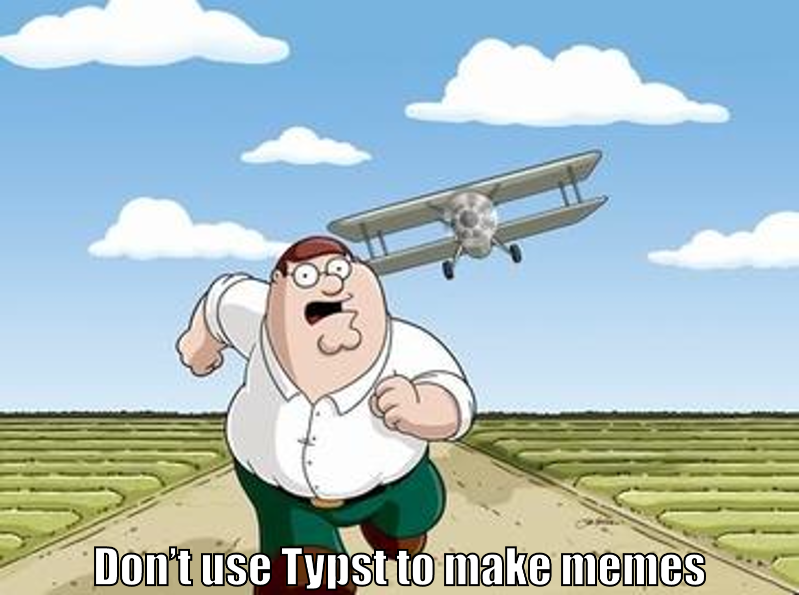

:blogpost: true
:date: 2025-07-19
:author: Elias Prescott

Making Memes with Typst
=======================

I've been having fun using `Typst`_ to make various documents, and the thought struck me that I should try making a meme with it.

.. _Typst: https://typst.app/

Code:

.. code-block:: typst

  #set text(48pt, font: "Impact", fill: white, stroke: (paint: black, thickness: 2pt))

  #image("griffin.jpg", width: 800pt)

  #place(
    center + bottom,
    dy: -10pt,
    [Don't use Typst to make memes],
  )

Command:

.. code-block:: sh

  typst compile meme.typ --format png

Output: 

