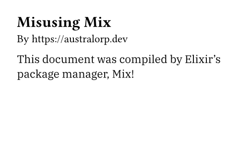

:blogpost: true
:date: 2026-01-13
:author: Elias Prescott

Misusing Mix
============

`Mix`_ is `Elixir's`_ official package manager.
It works great and I always took it for granted until I was working on a `Phoenix`_ project and I saw this dependency in my ``mix.exs`` file:

.. _Mix: https://hexdocs.pm/mix/Mix.html
.. _Elixir's: https://elixir-lang.org/
.. _Phoenix: https://phoenixframework.org/

.. code-block:: elixir

  {:heroicons,
  github: "tailwindlabs/heroicons",
  tag: "v2.2.0",
  sparse: "optimized",
  app: false,
  compile: false,
  depth: 1},

Mix takes this dependency definition and performs a sparse checkout of the heroicons repository, but it doesn't try to execute any Elixir code.
It is simply fetching part of the repository's contents, which will then be used by the application.

This got me thinking, how far can we push Mix?
Could we make it do something even more complex than this?

Recently, I used Nix to build some documents (:doc:`/articles/automate-your-documents-with-typst-and-nix/index`).
I thought it sounded like fun to try that same approach using Mix instead of Nix.

If you want to skip ahead and see the results, `here`_ is the repo with the code.

.. _here: https://github.com/EliasPrescott/misusing-mix

How to Misuse Mix
-----------------

First, we need a way of getting a working `Typst`_ executable.
Building Typst ourselves in a (mostly) reproducible way would require a ton of work.
We would essentially be recreating large parts of Nix in Elixir.

.. _Typst: https://typst.app

As fun as that sounds, I opted for just fetching the latest Typst release from their GitHub repo.

.. code-block:: elixir

  defmodule Mix.Tasks.FetchTypst do
    use Mix.Task

    @impl Mix.Task
    def run(_args) do
      fetch_typst()
    end

    def fetch_typst() do
      build_dir = Mix.Project.build_path()
      shell = Mix.shell()

      {arch, checksum} = case :os.type() do
        {:unix, :darwin} -> {"aarch64-apple-darwin", "470aa49a2298d20b65c119a10e4ff8808550453e0cb4d85625b89caf0cedf048"}
      end

      typst_path = "#{build_dir}/typst/typst-#{arch}/typst"
      already_have_typst = File.exists?(typst_path)

      if !already_have_typst do
        verify_res = shell.cmd("""
        mkdir typst
        cd typst
        echo '#{checksum}  typst.tar.xz' > typst.tar.xz.sha256
        curl -L https://github.com/typst/typst/releases/download/v0.14.2/typst-#{arch}.tar.xz > typst.tar.xz
        sha256sum -c typst.tar.xz.sha256
        rm typst.tar.xz.sha256
        """, cd: build_dir)

        if verify_res != 0 do
          shell.info("Failed to fetch or verify Typst download!")
          :error
        else
          res = shell.cmd("""
          cd typst
          tar xf typst.tar.xz
          """, cd: build_dir)
          if res == 0 do
            shell.info("Downloaded typst successfully!")
            typst_path
          else
            shell.info("Failed to unpack typst")
            :error
          end
        end
      else
        typst_path
      end
    end
  end

I started by making a `Mix task`_ for fetching Typst, but the real logic is just in the plain `fetch_typst/0` function.

.. _Mix task: https://hexdocs.pm/mix/Mix.Task.html

Next, I created a custom compiler that would call our fetch code and then use the Typst executable to compile a document:

.. code-block:: elixir

  defmodule Mix.Tasks.Compile.Typst do
    use Mix.Task.Compiler

    def run(_args) do
      case Mix.Tasks.FetchTypst.fetch_typst() do
        :error -> {:error, []}
        typst_path ->
          shell = Mix.shell()
          build_dir = Mix.Project.build_path()
          res = shell.cmd("""
          pushd "#{build_dir}" > /dev/null
          mkdir artifacts
          popd > /dev/null
          #{typst_path} compile \
            --ignore-system-fonts \
            --font-path deps/fonts \
            main.typ "#{build_dir}/artifacts/main.pdf"
          """, quiet: false)
          if res == 0 do
            shell.info("Wrote #{build_dir}/artifacts/main.pdf")
            :ok
          else
            {:error, []}
          end
      end
    end
  end

I didn't do anything too crazy here, but I will note that ``Mix.Project.build_path/0`` is very useful for grabbing the ``_build`` directory of the current Mix project.
You'll notice that I pass ``--font-path deps/fonts`` to Typst, and that's because we're about to add a dependency to fetch our fonts from GitHub.

.. code-block:: elixir

  defmodule MisusingMix.MixProject do
    use Mix.Project

    def project do
      [
        app: :misusing_mix,
        version: "0.1.0",
        elixir: "~> 1.19",
        start_permanent: false,
        deps: deps(),
        compilers: [:typst]
      ]
    end

    # Run "mix help compile.app" to learn about applications.
    def application do
      [
        extra_applications: [:logger]
      ]
    end

    # Run "mix help deps" to learn about dependencies.
    defp deps do
      [
        {:fonts,
          git: "https://github.com/google/fonts",
          ref: "9c5708e735fc805514913d46d259945a3b6ba67a",
          depth: 1,
          sparse: "ofl/ibmplexserif",
          app: false,
          compile: false}
      ]
    end
  end

Normally, the project definition defaults to using some built-in compilers, but I override it to just ``[:typst]`` so it will only call ``Mix.Tasks.Compile.Typst`` that we defined above.
I also added a sparse checkout of the Google fonts repository so we could use a custom font.
With Mix handled, now we just need to define our document and run the right commands:

.. code-block:: typst

  #set page(
    width: 3.5in,
    height: 2in
  )

  = Misusing Mix

  By https://australorp.dev

  #set text(font: "IBM Plex Serif")

  This document was compiled by Elixir's package manager, Mix!

.. code-block:: bash

  $ mix deps.get
  $ mix compile && open ~/misusing-mix/_build/dev/artifacts/main.pdf
  Wrote ~/misusing-mix/_build/dev/artifacts/main.pdf

And here is our result:

