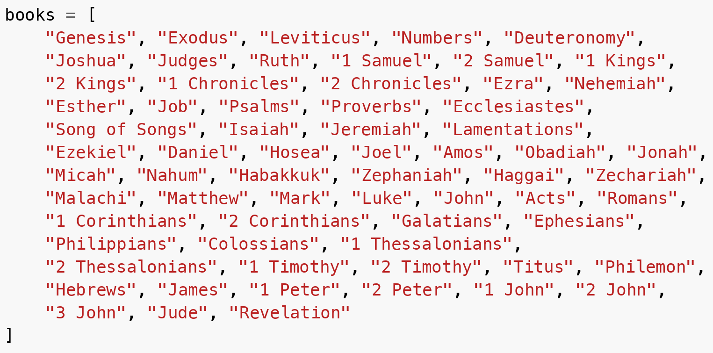

:blogpost: true
:date: 2025-10-16
:author: Elias Prescott
:tags: bible
:image: 1

..
  TODO: Make a custom directive that inherits from the meta directive and can automatically generate the SEO tags.
  This would require being able to query the AST from the directive run function, which might not be possible.
  I don't know if a custom builder would be a good (or the only) alternative or not.

.. meta::
   :description: Learn how to parse bible verse references using Python

   :property="og:url": https://australorp.dev/articles/parsing-bible-references-with-python/index.html
   :property="og:type": website
   :property="og:title": Parsing Bible References with Python — australorp.dev
   :property="og:description": Learn how to parse bible verse references using Python
   :property="og:image": /_images/cover.png

   :name="twitter:card": summary_large_image
   :property="twitter:domain": australorp.dev
   :property="twitter:url": https://australorp.dev/articles/parsing-bible-references-with-python/index.html
   :name="twitter:title": Parsing Bible References with Python — australorp.dev
   :name="twitter:description": Learn how to parse bible verse references using Python
   :name="twitter:image": /_images/cover.png

|

Parsing Bible References with Python
====================================

|

I like reading the bible and writing about it, but I don't like manually copying and pasting bible verses.
So, I write little parsers that can take a bible reference (e.g. "Genesis 1:1 (ESV)") and convert it into the referenced verses.

To make the parsing easy, I use `parsy`_ which is a lovely `parser combinator`_ library.
Here is how I do it:

.. _parsy: https://github.com/python-parsy/parsy
.. _parser combinator: https://en.wikipedia.org/wiki/Parser_combinator

.. note::

   This code is pulled directly from the source file that powers bible references on this blog,
   so it may change over time.

.. literalinclude:: ../../_ext/bible_ref_parser.py
   :language: python

Example usage:

>>> import bible_ref_parser
>>> bible_ref_parser.parse('Genesis 1:1 (CSB)')
BibleReference(book='Genesis', chapter=1, verse=1, version='CSB')
