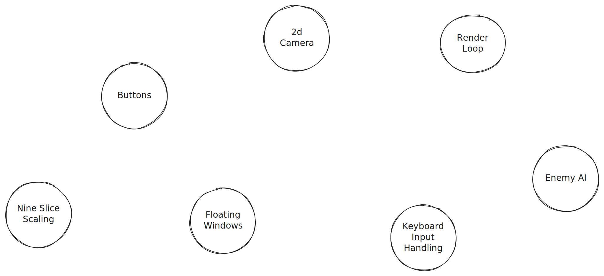
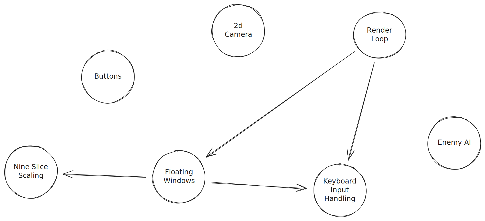

:blogpost: true
:date: 2025-09-26
:author: Elias Prescott

Putting Agency Back in My Design Process
========================================

I have been thinking about how Stephen Meyer said that top-down design implies intention or agency (`source`_). I want to look at how that applies to my approach in software design, because I think my recent design work has unfortunately lacked agency. My knowledge of programming leads me to a systems-level or a bottom-up design process, but that design process struggles due to mathematical reasons.

.. _source: https://youtu.be/rXexaVsvhCM

To explain exactly how I think my design process is flawed, I need to introduce the concept of search space. In an abstract sense, a search space is an N-dimensional graph where related ideas tend to congregate in clusters. To make the representation simple, I will use a 2-dimensional graph with unlabeled axes.

In this example, multiple video game concepts are graphed in our search space. The nodes are places in relation to each other roughly based on how I think their concepts relate. There are no edges between the nodes, because I believe making connections between these nodes is the process of design and implementation. This is a simplified view of the space because the true search space has an effectively infinite set of nodes. Many of the nodes would not have labels yet because no human has ever discovered the concept.

Every game you have ever played or imagined is a directed subset of this search space. Game design is the process of connecting nodes together to form a coherent graph. Design work is the process of discovering and linking the nodes together to form a connected subset of the larger search space. Implementation is the phase where these connections are concretely established in terms of code.

Now, I do not believe that the design process ends where implementation begins. You should be designing a piece of software all throughout your implementation phase, but how exactly you go about that is the tricky part.

I believe that implementation work should provide feedback to the design process. This happens either through discovery or constraint. If I am working on buttons for my game, and I find that I need some way to create a dynamic scaling texture for the background of the button, nine-slice scaling would be a natural discovery. By working on a concrete implementation for a node, I discover a nearby node in the search space. On the other hand, if I am working on a node and I discover that part of it is not technically feasible, then that is constraint. In that case, I would re-examine my design graph and likely chop that problematic node off from my graph.

Now that I have established how implementation can affect design work, I want to talk about how it should not affect design work. In my case, I realized that I allow my implementation work to *drive* my design work. Put simply, I had established little-to-no upfront design graph. I was picking random nodes in the graph that sounded useful and working on them. I was using the discoveries and constraints of the implementation work to explore small regions of the search space. I am referring to this as bottom-up design. Let's look at a simplified search space for the game I was working on recently.

This is the same space as earlier, but now you can see directed edges between the nodes. The direction loosely implies dependency between the nodes. The game's render loop depends on keyboard input and my implementation of flowing windows, and the floating windows depend on keyboard input and nine-slice scaling. This is a fine graph, but there is something wrong with how I got to this point.

I started by implementing nine-slice scaling. I did not start with a high-level vision of what I wanted in a game. I may have had some loose ideas in my subconscious, but I never actually established what my connected graph in the search space should look like. I technically started with a render loop because my game engine gives that to me by default, but then I decided to work on nine-slice scaling because it sounded useful. After implementing that concept, I was inspired to visit the nearby node, floating windows. I was then able to implement that node and connect it to my render loop.

I am not saying that this process of bottom-up design is inherently wrong, but I think it was misguided of me to solely rely on it. I needed to establish a top-down design first. And there is a simple reason why: humans are not equipped to deal with infinity.

Search Space Pruning
--------------------

When I was younger, I loved chess engines. I always wanted to write my own. I gave it a few tries (mostly using F#), but I never got very far because it is one of those programming problems that is easy to do poorly, but very difficult to do well. One of the ideas you will run into if you research chess engines is the idea of pruning. `ChessProgramming.org`_ refers to pruning as "a name for every heuristic that removes completely certain branches of the search tree."

.. _ChessProgramming.org: https://www.chessprogramming.org/Pruning

Just as software design can be represented as a graph of design concepts, any chess game can be represented by a graph (or a tree) of moves. The tree of possible moves is infinite at the start of the game (if you look forward at an infinite depth), but every move minimizes the tree because it cuts off branches. So, if you are writing a chess engine, iterating through the infinite tree of moves would take an infinite amount of time. You need techniques for limiting your search space, and pruning is one of those techniques.

The value of top-down design (in my opinion) is that it is the fastest way to limit or prune an effectively infinite search space. Whenever I imagine a video game, I can very quickly break that game down to its graph in the search space.

When I start designing or implementing a game bottom-up, I am starting at a single node or feature and attempting to find nearby nodes in the search space. The problem with solely relying on this approach is that it does very little to limit the search space. A purely bottom-up approach provides little pruning and it leaves nearly the entire search space open for you to consider. As I mentioned earlier, bottom-up design does offer some design feedback because you can discover nearby nodes in the search space. But those discoveries are not a suitable replacement for top-down design because they are unreliable and there is no guarantee they will provide a coherent design graph.

When I finish a node, there is a chance I will have not discovered any useful nodes nearby to work on next. Every time that happens, I am left to ponder the infinite search space, a task for which humans are not well suited. And even if I am discovering lots of nearby nodes to work on, there is no guarantee that I will end up with a coherent graph at the end of it all. I believe coherence in design comes from the top-down pruning process.

For the example graph I showed earlier, I have no idea what feature to work on next. This is because I do not actually have a high-level concept of what I want the game to look like. If I want to keep working on it, I need to take a step back and actually decide what game I would want to make. Then I would have a much smaller subset of the search space that I could easily work on. This concept sounds obvious, but I think it is extremely easy to slip into pure bottom-up design without realizing.

Conclusion
----------

Never traverse the infinite search space. Start with a top-down design to limit the search space, then you can use bottom-up design to implement features and provide feedback for your established design graph.
